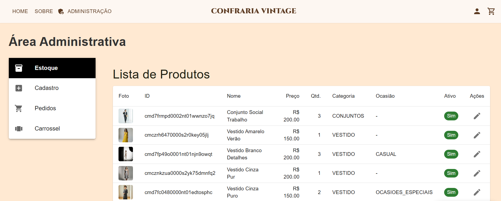
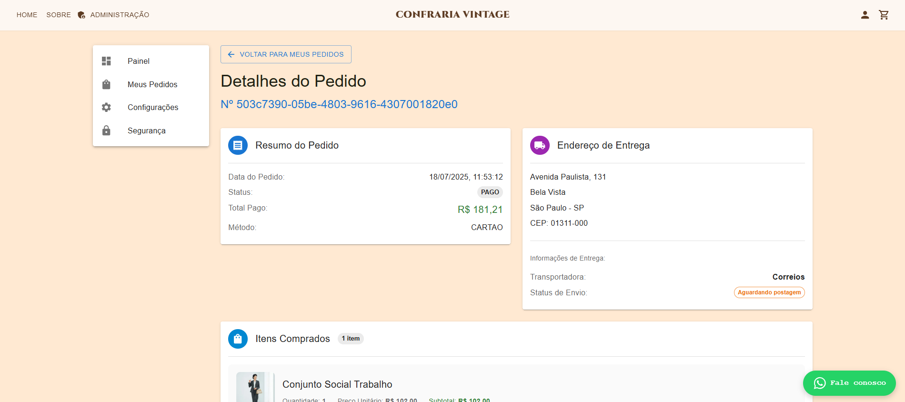
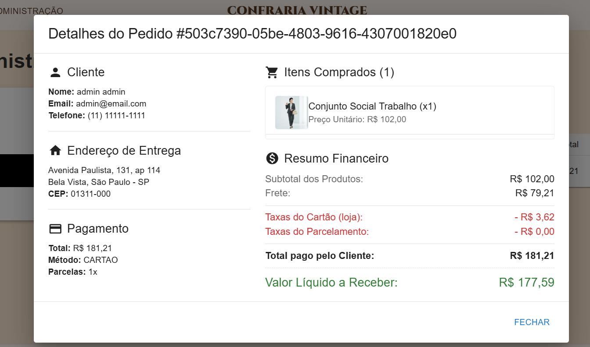
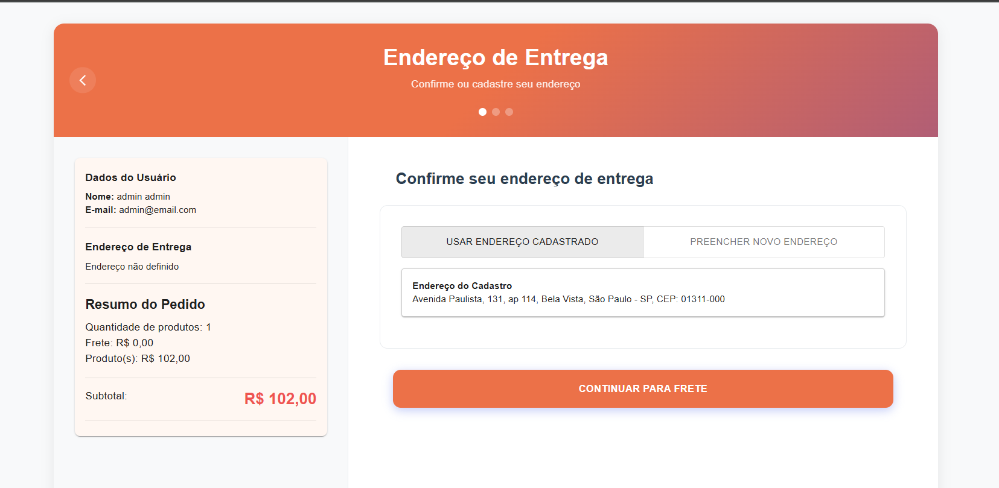
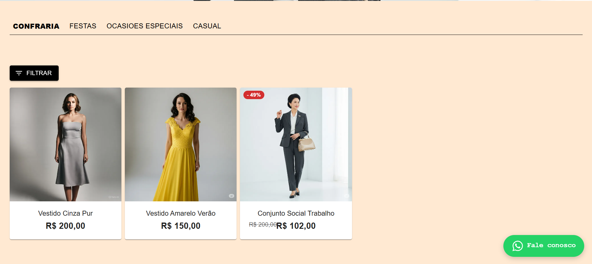
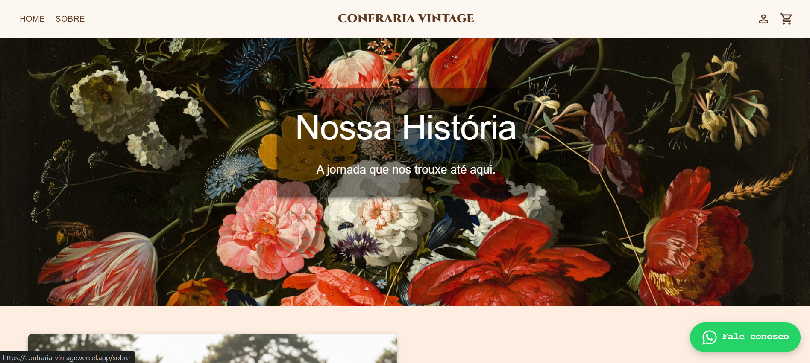

# Especificações do Projeto

## Usuários

| Tipo de Usuário   | Descrição | Responsabilidades |
|------------------|-----------|------------------|
| **Administrador** | Gerencia as aplicações do site. | Altera funções do layout; cria e gerencia novos produtos; gerencia pedidos feitos pelos clientes; faz envios; |
| **Cliente** | Comprador do produto | Cadastro e Login; Compra produtos; Analisa os próprios pedidos |

## Arquitetura e Tecnologias

### Frontend
Utizaremos React para realização do site em Desktop e responsivo para Mobile;

### Backend
Um servidor criado com node.js integrado com o DB em MySql;

### Gerenciamento de Fluxo
Para gerenciar as atividades feitas, utilizamos a metodologia Kanban através do GitHub Projects, conforme imagem abaixo

## Project Model Canvas

## Requisitos

### Requisitos Funcionais

|ID    | Descrição do Requisito  | Prioridade |
|------|-----------------------------------------|----|
|RF-001| O sistema deve permitir que o usuário compre produtos | ALTA | 
|RF-002| O sistema deve permitir que o cliente tire dúvidas sobre produtos diretamente no WhatsApp.   | MÉDIA |
|RF-003| O sistema deve permitir que os administradores adicionem, editem ou removam produtos do catálogo.  | MÉDIA |
| RF-004| O sistema deve exibir as formas de pagamento aceitas na loja física | ALTA |
| RF-005 | O sistema deve permitir a aplicação de filtros. | MÉDIA |
| RF-006 | O sistema deve permitir que o cliente adicione produtos ao carrinho. | ALTA |
| RF-007 | O sistema deve permitir que os administradores alterem o layout do carrossel | ALTA |
| RF-008 | O sistema deve permitir que os administradores façam envios | ALTA |

## Area de Administração

## Area do Usuário

## Informações do Pedido (Adm)

## Area de Pagamento 

## Catalogo

## Pagina SOBRE NÓS
