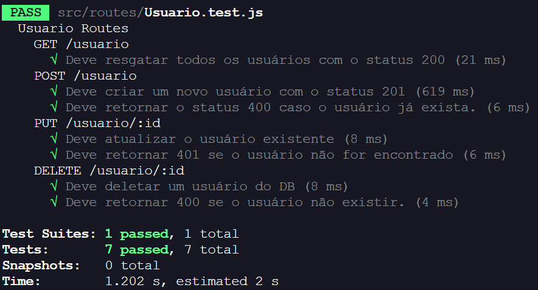
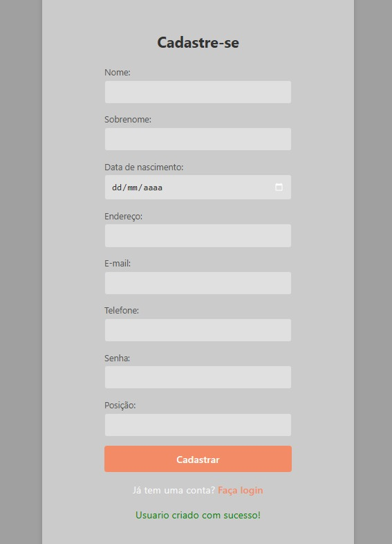
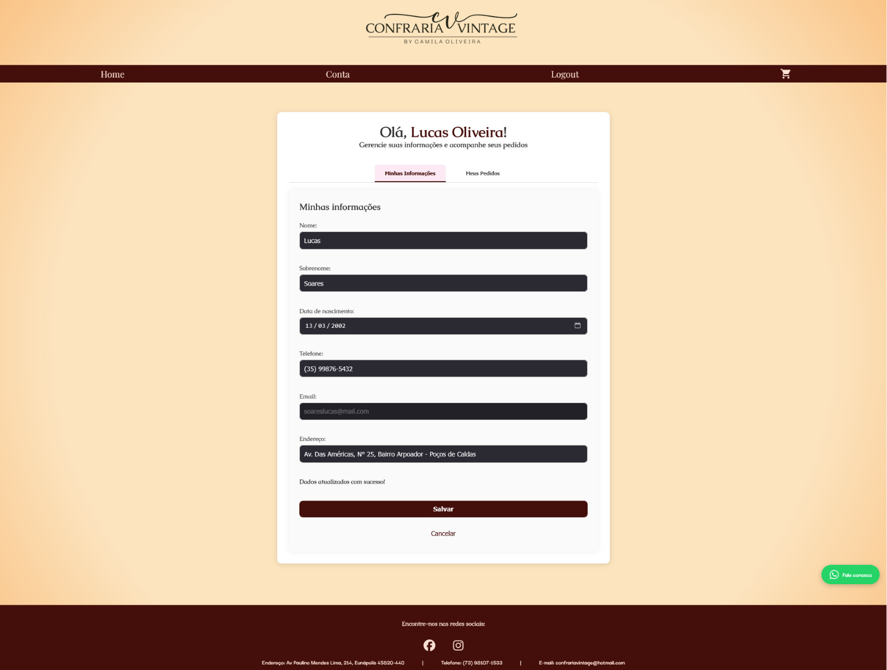
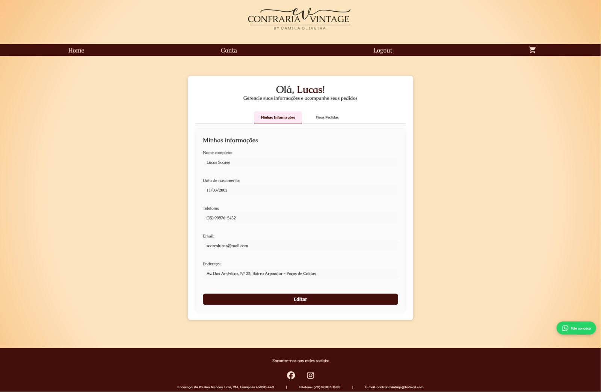

# Planos de Testes de Software

Apresente os casos de testes utilizados na realização da verificação e validação da aplicação. Escolha cenários de testes que demonstrem os requisitos sendo satisfeitos bem como o tratamento de erros (robustez da aplicação).

### Tipo de Teste

- **Sucesso**: Tem o objetivo de verificar se as funcionalidades funcionam corretamente.
- **Insucesso**: Tem o objetivo de verificar se o sistema trata erros de maneira correta.

#### Exemplo de Caso de Teste de Sucesso

<table>
  <tr>
    <th colspan="2" width="1000">CT-001 Login com credenciais válidas</th>
  </tr>
  <tr>
    <td width="150"><strong>Descrição</strong></td>
    <td>Este caso de teste verifica se um usuário pode fazer login com sucesso utilizando credenciais válidas.</td>
  </tr>
  <tr>
    <td><strong>Responsável Caso de Teste </strong></td>
    <td width="430">José da Silva</td>
  </tr>
 <tr>
    <td><strong>Tipo do Teste</strong></td>
    <td width="430">Sucesso</td>
  </tr> 
  <tr>
    <td><strong>Requisitos associados</strong></td>
    <td>RF-001: O funcionário deve conseguir logar no aplicativo</td>
  </tr>
  <tr>
    <td><strong>Passos</strong></td>
    <td>
      1. Abrir o aplicativo. 
      2. Inserir o CPF válido. 
      3. Inserir a senha válida. 
      4. Clicar no botão "Entrar".
      </td>
  </tr>
    <tr>
    <td><strong>Dados de teste</strong></td>
    <td>
      - <strong>CPF:</strong> Colocar CPF cadastrado na base 
      - <strong>Senha:</strong> Colocar valor de senha válida
  </tr>
    <tr>
    <td><strong>Critérios de êxito</strong></td>
    <td>O sistema deve redirecionar o usuário para a página inicial do aplicativo após o login bem-sucedido.</td>
  </tr>
</table>

#### Exemplo de Caso de Teste de Insucesso

<table>
  <tr>
    <th colspan="2" width="1000">CT-001 Login com credenciais inválidas</th>
  </tr>
  <tr>
    <td width="150"><strong>Descrição</strong></td>
    <td>Este caso de teste verifica o tratamento de credenciais inválidas no login.</td>
  </tr>
  <tr>
    <td><strong>Responsável Caso de Teste </strong></td>
    <td width="430">José da Silva</td>
  </tr>
 <tr>
    <td><strong>Tipo do Teste</strong></td>
    <td width="430">Insucesso</td>
  </tr> 
  <tr>
    <td><strong>Requisitos associados</strong></td>
    <td>RF-001: O funcionário não conseguirá logar no aplicativo</td>
  </tr>
  <tr>
    <td><strong>Passos</strong></td>
    <td>
      1. Abrir o aplicativo. 
      2. Inserir o CPF válido. 
      3. Inserir a senha inválida. 
      4. Clicar no botão "Entrar".
      </td>
  </tr>
    <tr>
    <td><strong>Dados de teste</strong></td>
    <td>
      - <strong>CPF:</strong> Colocar CPF cadastrado na base 
      - <strong>Senha:</strong> Colocar senha inválida
  </tr>
    <tr>
    <td><strong>Critérios de êxito</strong></td>
    <td>O sistema deve apresentar a mensagem de login inválido.</td>
  </tr>
</table>

# Evidências de Testes de Software

Apresente imagens e/ou vídeos que comprovam que um determinado teste foi executado, e o resultado esperado foi obtido. Normalmente são screenshots de telas, ou vídeos do software em funcionamento.

## Parte 1 - Testes Unitários

Cada funcionalidade desenvolvida deve ser testada utilizando os casos de testes (sucesso e insucesso) criados pelo responsável pela funcionalidade. Todos os testes devem ser evidenciados.

### Exemplo

<table>
  <tr>
    <th colspan="6" width="1000">CT-001 Login com credenciais válidas</th>
  </tr>
  <tr>
    <td width="170"><strong>Critérios de êxito</strong></td>
    <td colspan="5">O sistema deve redirecionar o usuário para a página inicial do aplicativo após o login bem-sucedido.</td>
  </tr>
    <tr>
    <td><strong>Responsável pelo Teste</strong></td>
    <td width="430">José da Silva </td>
     <td width="100"><strong>Data do Teste</strong></td>
    <td width="150">08/05/2024</td>
  </tr>
    <tr>
    <td width="170"><strong>Comentário</strong></td>
    <td colspan="5">O sistema está permitindo o login corretamente.</td>
  </tr>
  <tr>
    <td colspan="6" align="center"><strong>Evidência</strong></td>
  </tr>
  <tr>
    <td colspan="6" align="center"><video src="https://github.com/ICEI-PUC-Minas-PMV-ADS/pmv-ads-2024-1-e5-proj-time-sheet/assets/82043220/2e3c1722-7adc-4bd4-8b4c-3abe9ddc1b48"/></td>
  </tr>
</table>

## Parte 2 - Testes por pares

A fim de aumentar a qualidade da aplicação desenvolvida, cada funcionalidade deve ser testada por um colega e os testes devem ser evidenciados. O colega "Tester" deve utilizar o caso de teste criado pelo desenvolvedor responsável pela funcionalidade (desenvolveu a funcionalidade e criou o caso de testes descrito no plano de testes).

### Teste de Cadastro de Usuário

<table>
  <tr>
    <th colspan="6" width="1000">Cadastro de Usuário</th>
  </tr>
  <tr>
    <td width="170"><strong>Critérios de êxito</strong></td>
    <td colspan="5">O sistema deve permitir que um usuário seja criado</td>
  </tr>
    <tr>
    <td><strong>Responsável pela funcionalidade</strong></td>
    <td width="430">Lucas Oliveira Soares </td>
      <td><strong>Responsável pelo teste</strong></td>
    <td width="430">Marco Antonio Gil </td>
     <td width="100"><strong>Data do teste</strong></td>
    <td width="150">03/04/2025</td>
  </tr>
    <tr>
    <td width="170"><strong>Comentário</strong></td>
    <td colspan="5">O sistema está permitindo o cadastro corretamente.</td>
  </tr>
  <tr>
    <td colspan="6" align="center"><strong>Evidência</strong></td>
  </tr>
  <tr>
    <td colspan="6" align="center">
    
    
    </td>
  </tr>
</table>

### Teste de Cadastro de Produto

<table>
  <tr>
    <th colspan="6" width="1000">Cadastro de Produto</th>
  </tr>
  <tr>
    <td width="170"><strong>Critérios de êxito</strong></td>
    <td colspan="5">O sistema deve permitir que o produto seja excluído, criado corretamente e que tenha a validação dos campos ( Tamanho e Cor</td>
  </tr>
    <tr>
    <td><strong>Responsável pela funcionalidade</strong></td>
    <td width="430">Matheus Soares </td>
      <td><strong>Responsável pelo teste</strong></td>
    <td width="430">Lucas Henrique </td>
     <td width="100"><strong>Data do teste</strong></td>
    <td width="150">05/04/2025</td>
  </tr>
    <tr>
    <td width="170"><strong>Comentário</strong></td>
    <td colspan="5">O sistema está permitindo a validação dos campos, criação e exclusão corretamente.</td>
</table>

    
### Teste de Cadastro de Usuário

<table>
  <tr>
    <th colspan="6" width="1000">Cadastro de Usuário</th>
  </tr>
  <tr>
    <td width="170"><strong>Critérios de êxito</strong></td>
    <td colspan="5">O sistema deve permitir que um usuário seja criado</td>
  </tr>
    <tr>
    <td><strong>Responsável pela funcionalidade</strong></td>
    <td width="430">Lucas Oliveira Soares </td>
      <td><strong>Responsável pelo teste</strong></td>
    <td width="430"> Carlos Eduardo Dos Santos Lima </td>
     <td width="100"><strong>Data do teste</strong></td>
    <td width="150">30/04/2025</td>
  </tr>
    <tr>
    <td width="170"><strong>Comentário</strong></td>
    <td colspan="5">O sistema está permitindo o cadastro corretamente.</td>
  </tr>
  <tr>
    <td colspan="6" align="center"><strong>Evidência</strong></td>
  </tr>
  <tr>
    <td colspan="6" align="center">
    
    
    
    </td>
  </tr>
</table>

<table>
  <tr>
    <th colspan="6" width="1000">Cadastro de Usuário</th>
  </tr>
  <tr>
    <td width="170"><strong>Critérios de êxito</strong></td>
    <td colspan="5">O sistema deve permitir que um usuário seja criado</td>
  </tr>
    <tr>
    <td><strong>Responsável pela funcionalidade</strong></td>
    <td width="430">Lucas Oliveira Soares </td>
      <td><strong>Responsável pelo teste</strong></td>
    <td width="430"> Carlos Eduardo Dos Santos Lima </td>
     <td width="100"><strong>Data do teste</strong></td>
    <td width="150">29/05/2025</td>
  </tr>
    <tr>
    <td width="170"><strong>Comentário</strong></td>
    <td colspan="5">O sistema está permitindo o cadastro corretamente.</td>
  </tr>
  <tr>
    <td colspan="6" align="center"><strong>Evidência</strong></td>
  </tr>
  <tr>
    <td colspan="6" align="center">
    
    
    </td>
  </tr>
</table>

### Teste de Login

<table>
  <tr>
    <th colspan="6" width="1000">Login</th>
  </tr>
  <tr>
    <td width="170"><strong>Critérios de êxito</strong></td>
    <td colspan="5">O sistema deve permitir que o usuário faça o login na conta cadastrada</td>
  </tr>
    <tr>
    <td><strong>Responsável pela funcionalidade</strong></td>
    <td width="430">Lucas Oliveira Soares </td>
      <td><strong>Responsável pelo teste</strong></td>
    <td width="430"> Carlos Eduardo Dos Santos Lima </td>
     <td width="100"><strong>Data do teste</strong></td>
    <td width="150">30/04/2025</td>
  </tr>
    <tr>
    <td width="170"><strong>Comentário</strong></td>
    <td colspan="5">O sistema está permitindo o login corretamente.</td>
  </tr>
  <tr>
    <td colspan="6" align="center"><strong>Evidência</strong></td>
  </tr>
  <tr>
    <td colspan="6" align="center">
    
    
    
    </td>
  </tr>
</table>

<table>
  <tr>
    <th colspan="6" width="1000">Login</th>
  </tr>
  <tr>
    <td width="170"><strong>Critérios de êxito</strong></td>
    <td colspan="5">O sistema deve permitir que o usuário faça o login na conta cadastrada</td>
  </tr>
    <tr>
    <td><strong>Responsável pela funcionalidade</strong></td>
    <td width="430">Lucas Oliveira Soares </td>
      <td><strong>Responsável pelo teste</strong></td>
    <td width="430"> Carlos Eduardo Dos Santos Lima </td>
     <td width="100"><strong>Data do teste</strong></td>
    <td width="150">29/05/2025</td>
  </tr>
    <tr>
    <td width="170"><strong>Comentário</strong></td>
    <td colspan="5">O sistema está validando e permitindo o login corretamente.</td>
  </tr>
  <tr>
    <td colspan="6" align="center"><strong>Evidência</strong></td>
  </tr>
  <tr>
    <td colspan="6" align="center">
    
    
    
    </td>
  </tr>
</table>

### Teste de Gerenciamento de Pedidos pelo Administrador

<table>
  <tr>
    <th colspan="6" width="1000">Gerenciamento de pedidos</th>
  </tr>
  <tr>
    <td width="170"><strong>Critérios de êxito</strong></td>
    <td colspan="5">O sistema deve permitir que o administrador faça o gerenciamento dos pedidos</td>
  </tr>
    <tr>
    <td><strong>Responsável pela funcionalidade</strong></td>
    <td width="430">Lucas Oliveira Soares </td>
      <td><strong>Responsável pelo teste</strong></td>
    <td width="430"> Carlos Eduardo Dos Santos Lima </td>
     <td width="100"><strong>Data do teste</strong></td>
    <td width="150">29/05/2025</td>
  </tr>
    <tr>
    <td width="170"><strong>Comentário</strong></td>
    <td colspan="5">O sistema permite a classificação como enviado e cancelado conforme o previsto.</td>
  </tr>
  <tr>
    <td colspan="6" align="center"><strong>Evidência</strong></td>
  </tr>
  <tr>
    <td colspan="6" align="center">
    
    
    
    </td>
  </tr>
</table>

### Teste Informações do Usuário

<table>
  <tr>
    <th colspan="6" width="1000">Informações do Usuário</th>
  </tr>
  <tr>
    <td width="170"><strong>Critérios de êxito</strong></td>
    <td colspan="5">O sistema deve permitir que o usuário autenticado visualize e edite suas informações.</td>
  </tr>
    <tr>
    <td><strong>Responsável pela funcionalidade</strong></td>
    <td width="430">Carlos Eduardo Dos Santos Lima</td>
      <td><strong>Responsável pelo teste</strong></td>
    <td width="430">Lucas Oliveira Soares</td>
     <td width="100"><strong>Data do teste</strong></td>
    <td width="150">01/06/2025</td>
  </tr>
    <tr>
    <td width="170"><strong>Comentário</strong></td>
    <td colspan="5">O sistema permite a visualização e edição das informações do usuário.</td>
  </tr>
  <tr>
    <td colspan="6" align="center"><strong>Evidências</strong></td>
  </tr>
  <tr>
    <td colspan="6" align="center">
      
      
      
    </td>
  </tr>
</table>

